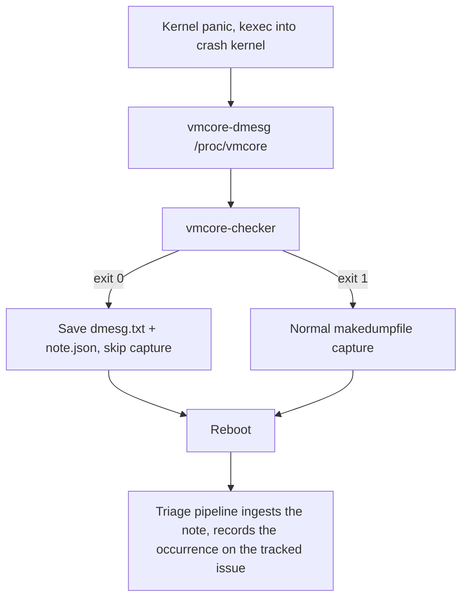

# vmcore-checker

Skip vmcore capture for crashes we already know about.

`vmcore-checker` runs inside the kdump crash kernel. It parses the
crashed kernel's log (extracted from `/proc/vmcore` with `vmcore-dmesg`
or `makedumpfile --dump-dmesg`), computes deterministic crash
fingerprints (via
[`github.com/sdimitro/crashfp`](https://github.com/sdimitro/crashfp)),
and compares them against a curated skip-list of known issues. On a
match it writes a small `note.json` and exits `0`, letting the kdump
hook skip the multi-minute vmcore capture and reboot immediately. The
note is uploaded where the dump would have gone, so the triage pipeline
that processes dumps post-reboot can still record the occurrence on the
tracked issue.

Anything unexpected — unknown crash, unparsable log, missing file,
corrupt skip-list — exits `1` and the dump is captured normally.
**The tool always fails open.**

The [`note`](note/) package defines the `note.json` wire format and can
be imported by note consumers, so the format cannot drift between the
writer and its readers.

## Usage

```
vmcore-checker [--stream] [--skiplist extras] [--note out.json] dmesg.txt
vmcore-checker --print-skiplist
vmcore-checker --version
```

Exit codes: `0` known issue matched (skip capture), `1` anything else
(capture normally).

By default the log is loaded whole, so peak memory is about the file
size plus ~1 MB. With `--stream` it is parsed line by line in **constant
memory** (<1 MB even for a 32 MiB log) — useful when the crashkernel
reservation is very tight. Both modes produce byte-identical results;
that equivalence is enforced by tests and by the release parity gate.

## Skip-list

The primary skip-list is **embedded in the binary** at build time from
`skiplist.txt`. Generate it from your crash-tracking system (issue
tracker, database, …) before building; keep it curated — e.g. only
issues with several recorded occurrences, or explicitly flagged by a
human — so first occurrences always get a full dump.

`--skiplist <file>` merges extra entries on top — for hot-adding a known
issue on a node without rebuilding the initramfs. Line format:

```
# generated 2026-07-14T12:00:00Z from KERN
fp-type-rip:de433837302e1e77 fp-top3:9a1b2c3d4e5f6071 KERN-1234
```

One entry per line: the 16-hex prefix of the crash's `type_rip`
fingerprint hash (required), optionally the `top3` prefix, and
optionally an issue key that gets recorded in the note. When a line
carries `fp-top3`, both hashes must match (more conservative).

Malformed entries are **skipped with a warning** rather than treated as
fatal — a bad hand-added line can only cause a missed match (the dump
gets captured anyway), never a wrong skip, and must not disable the
fast path for the whole node. Hash prefixes shorter than 12 hex chars
count as malformed so a truncated hash cannot become a dangerously
broad match. A missing or unreadable `--skiplist` file is still a hard
error: an explicit flag pointing nowhere is a deployment bug.

## Building

```bash
make build            # host build
make linux-arm64      # static cross-build for the crash kernel (~2.2 MB)
make size-check       # cross-builds and enforces the 2.2 MiB size budget
make test

make tiny-linux-arm64 # TinyGo build (~750 KB), needs tinygo installed
make verify-tiny      # parity gate: stock vs tiny must behave identically
make tiny-size-check  # enforces the 1 MiB tiny budget
```

Builds are static (`CGO_ENABLED=0`), stripped (`-s -w`), and reproducible
(`-trimpath`). Stdlib only — the binary lands well under the initramfs
budget and peaks below 10 MB RSS on a full kernel log. The `note`
package's JSON encoder is hand-rolled (byte-identical to `encoding/json`,
enforced by tests) so write-only binaries never link the reflection-based
encoder.

For the tightest initramfs budgets there is also a
[TinyGo](https://tinygo.org) build (`vmcore-checker-tiny-linux-*`,
~750 KB, ~3x smaller). It compiles the exact same source;
[scripts/verify-tiny.sh](scripts/verify-tiny.sh) gates it by requiring
identical exit codes and byte-identical notes against the stock build
across the whole golden corpus and all fail-open cases, in CI and again
at release time.

Tagged releases publish raw binaries (linux amd64/arm64, macOS arm64),
TinyGo binaries (linux amd64/arm64), and `.deb` packages for both
(linux amd64/arm64) with sha256 checksums; debs are built by
[scripts/build-deb.sh](scripts/build-deb.sh). The `vmcore-checker` and
`vmcore-checker-tiny` packages both install `/usr/bin/vmcore-checker`
and conflict with each other, so install exactly one.

## Crash-kernel integration

See [scripts/kdump-precapture-hook.sh](scripts/kdump-precapture-hook.sh)
for the pre-capture hook: extract dmesg, run the checker, skip or
capture based on the exit code.



## License

MIT — see [LICENSE](LICENSE).
